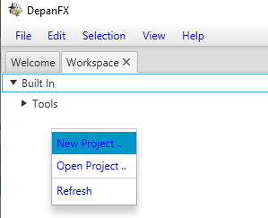
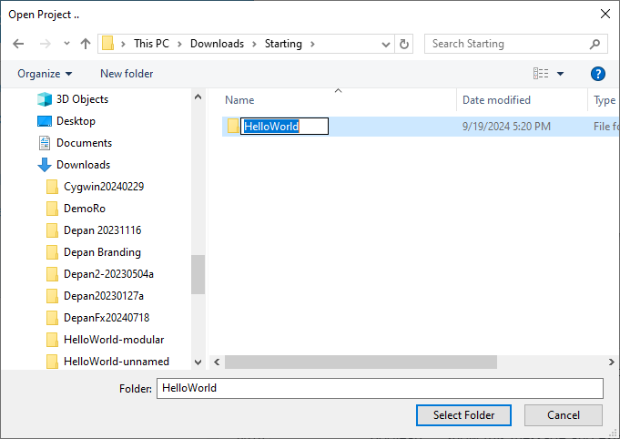
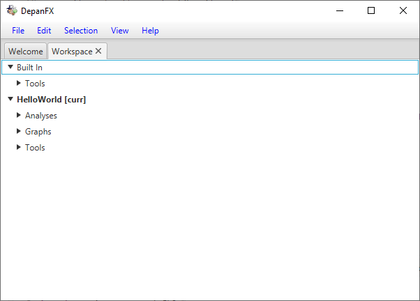
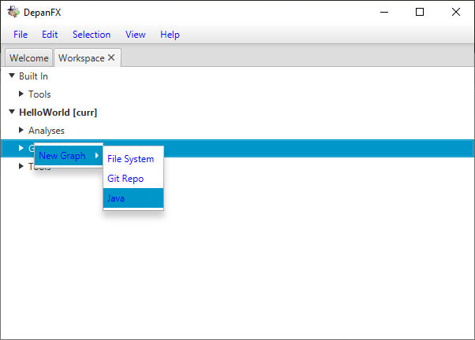
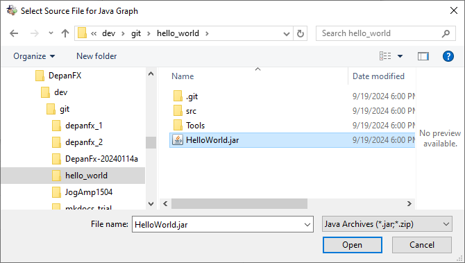
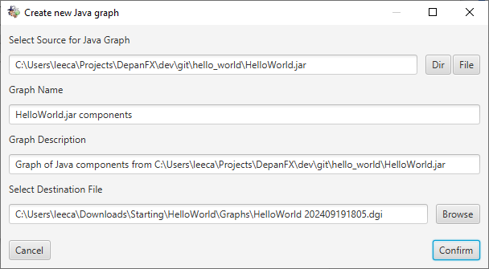

# Getting Started

When DepanFX initially starts, the session frame is initialized with two “editor” tabs.

The first tab, and the one displayed on startup, is the Welcome tab.
The Welcome tab provides a cheery entrance to DepanFX.
Say “hi” to DepanFX’s mascot, Code Inspector (CI) Gonzo.
<br/>
The Welcome tab can be closed or ignored in most DepanFX sessions.

The second tab, labeled Workspace, is the main starting point for many DepanFX analysis.
At the top level, a session’s workspace is a collection of projects.
Each project holds many different analysis resource,
typically grouped by system under analysis.
These include dependency graphs, lists of interesting nodes,
and assorted tools for extracting data from the graphs.

When DepanFX starts, the workspace is initialized with a “Built In” project.
This project provides a number of general purpose artifacts that can be used
in the analysis of many software systems.

## First Steps
Once DepanFX starts, it’s time to start analyzing a software system.  This requires:

1. Setting up an area to hold our analysis.
1. Obtaining the dependency graph for the system under analysis.
1. Opening the dependency graph, and searching for interesting structures.

These steps are discussed in each of the following sections.

For these steps, the examples are based on a simple implementation
of the classic “Hello, World!” application.
This implementation is available on GitHub at <https://github.com/pnambic/hello_world>.
The repository includes the source code, a build script,
and the packaged HelloWorld.jar.
If you clone the repository, you should be able to run the application with the Java interpreter.

```bash
$ java -jar HelloWorld.jar
Hello, World!
```


Although this is a simple system to analyze,
it is a good introduction to DepanFX’s capabilities.

## Create A Project
Once DepanFX starts, the first action is the creation of a new project.
The new project will hold the analysis artifacts for a system under analysis.

1. Select the Workspace tab.
1. Right click in the Workspace panel to bring up the context menu.
1. Select “New Project…”<br/>

1. In the System’s folder chooser, create a new folder (e.g. HelloWorld).
1. Select the new folder as the folder chooser’s result.

1. DepanFX populates the new folder standard analysis artifact folder
1. The new project folder is presented in the Workspace panel’s tree of projects.


Although any folder can be used as a project,
DepanFX will configure an empty folder with some internal structures that are
practical for software analysis projects.

These internal folders for a DepanFX project are

1. Graphs:  A folder to contain the full dependency graphs for systems under analysis.  Graphs include all of the nodes and their relationships.
1. Analyses: A folder to contain analysis artifacts based on data from the various dependency graphs.  These include node list and visualization.
1. Tools: A folder to contain tool and option settings used during system analysis.  This folder is often further subdivided for different tool categories.

Creating or opening a project brings the project's directory structure
into the tree of items shown by the Workspace panel.
The project’s name is shown in bold, with the Analyses, Graphs,
and Tools directories available for access.

## Adding A Dependency Graph
Dependency graphs combine a collection of nodes with a collection of edges.
The elements define the basic structure of DepanFX’s approach to system analysis.
Dependency graphs are typically obtained from a snapshot of the system under analysis.
The dependency graph information is stored in a file ending `.dgi`
(an XML file that contains depan graph information).

The Graphs directory in a project provides a context menu that includes dependency graph creation.  A right-click on the Graphs folder brings up the context menu for this item.
The context menu for the Graphs folder includes several options to create a new dependency graph.
These options include:

* File System - create a File System dependency graph from a directory.
* Git Repo - create a File System dependency graph from a git repository.
* Java - create a Java dependency graph from a file or directory.

From the Graphs folder’s context menu, selecting the menu item `New Graph > Java`


brings up a dialog box to create a new dependency graph based on the Java Graph Model.


The highlighted numbers and buttons correspond with the
following sequence of actions for completing the dialog.
Once the dialog is complete,
Depan builds the dependency graph for the HelloWord
application and adds it to the Hello World Project.
The packaged jar file HelloWorld.jar provides a good start for exploring the
structure of Java applications.

1. Use the File button to open a File Chooser as the dependency source.
Navigate to the hello_world git clone, and select the HelloWorld.jar file.

1. Edit the inferred Graph Name if you want.
To follow the example, use “Hello World”.
1. Edit the inferred Graph Description if you want.
To follow the example, leave this unchanged.
1. Use the Browse button to open a File Chooser.
With the destination file empty,
Depan will infer a filename based on the Graph Name (step 2) with an autogenterated timestamp.
<br/>
The interface will propose a file name in the Graphs container.
You can change the name, but the Graphs container is recommended.
To follow the example, use “HelloWorld” with the autogenerated timestamp.
1. Use the Confirm button to start the dependency graph construction.


For large systems, dependency graph construction may take several seconds.
There is currently no progress meter or other mechanism to interact with this
or other long running processes.

Once the dependency graph construction is complete,
there will be a new document under the Graphs directory.
<br/>
The file `HelloWorld yyyyMMddhhmm.dgi` contains a snapshot of the
Java nodes and their relationships from within the `HelloWorld.jar` file.

## Node List Table

The node list table provides a tabular view of nodes from a dependency graph.
The node list is often a subset of all the nodes in a dependency graph.
The analysis tools for dependency graphs (i.e. “.dgi” files) start
with a node list for all nodes in the graph.
Although DepanFX is comfortable with these large dependency graphs,
it can be daunting to start with everything.

The Node List Table tab provides a compact and scalable presentation of selected nodes.
It is a presentation mechanism that is reused throughout DepanFX.
The ability to select and flexibly organize nodes is a key feature of DepanFX.

Although the HelloWorld example is not so overwhelming,
the node list table is still a good place to start.
Right click on the “HelloWorld yyyyMMddhhmm.dgi” file to open the context menu,
and select the Open As Node List menu item.

A new Node List Table tab will appear in the Editor region.
Selecting the new tab will show the node list table in the Editor region.

Although the Node List Table structure is quite flexible,
the initial structure provides a tree section based on membership,
and a flat section that holds any left over nodes.
There are two columns, one that shows the name of each node and
one that shows the node kind for each node.

Opening the Tree section of the node list table shows 5 top level trees.
The HelloWorld node of type Document and the java node of type Directory
are inferred elements based on the dependency source.
These trees can be ignored.

The most interesting Java elements are in the two nodes of type Package.
The com node contains the elements of the Hello, World implementation.
The java node contains the Java elements that the implementation code relied upon.

Right click on the `com` node, and select the `Select Recursive` menu item.
The entire tree of software components is now selected.

Right click on the `java` node of type `Package`,
and do the same - select the `Select Recursive` menu item.
These items will be the focus of our further analysis.

The current set of selected nodes can be saved as a node list.
This allows future analysis to use the same starting point consistently.
It captures the state of analysis,
and can be combined with other node list to offer insights on the structure of the system.

In order to save the table’s selected nodes as a new node list,
use the context menu from the Node List Table tab.
The Save Node List option (towards the bottom),
brings up the Node List Save dialog box.
This dialog box allows you to name the node list,
provide a description, and set the destination file for the node list.

By recommended best practices, node lists are placed into the Analyses directory.
This helps separate graphs from different analysis efforts.
Complex analyses may benefit from additional substructure and directories
within the Analyses directory.

After saving the node list, there will be a new document under the Analyses directory.
The file “HelloWorld Java yyyyMMddhhmm.dnli” lists the nodes that are Java components.
The relationships between the nodes remain in the dependency graph and are accessible when needed.

If you select the new file in the Analyses directory and select the Open As Node List menu item,
a new tab appears in the Editor tab panel.
As before, selecting the tab will show a node list table in the Editor region.
This table will have only 16 nodes, consisting entirely of the Java components.

## Node View

The Node View editor provides powerful display mechanisms for a system’s nodes and relationships.
The display mechanisms use OpenGL to render high quality diagrams
of the nodes and their dependencies.
With various zoom and direction controls, it is possible to “fly”
through the code as you examine its structure.

In order to open the Node View editor, activate the Workspace tab.
Select a Node List artifact (extension .dnli), and bring up the context menu.
Selecting the Open as Node View menu item will open a Node View editor for the node list.

With a new node list, none of the nodes have been assigned a location.
The Node View editor initially uses a grid layout
to place each node separately on a grid.
If there are more than a handful of nodes,
the initial node zoom will only show a few nodes.

With the HelloWorld Java.dnli components, the nodes layout in a simple 4-by-4 grid.
This is readily seen be zooming out a bit (mouse scroll).

Although the 4-by-4 grid shows all the nodes without overlapping,
it is not the most useful.
A tree presentation based on Java component membership would
better display the code’s structure.

From the context menu on the Node View tab,
select the `Layout Nodes > Radial Layout` menu option.
The resulting dialog box allows you to determine the relationship that defines the hierarchy.
One very useful relationship defined by the Java Tree Membership matcher.
This matcher includes all edges for any Java containers and constituents.

1. Right click on the resource name to bring up a resource chooser.
1. Use the resource chooser to select the Java Tree Members link matcher
at `Built in > Tools > Link Matchers > Java > Java Tree Members`.

Once the layout information is complete,
DepanFX saves the layout definition and uses it to assign new locations to the nodes.
The new layout better reflects the structural relationships between the nodes.

Although the layout shows the structure of the nodes,
the displayed edges create clutter in the view.
The rendered edges can be controlled by the Edge Visibility menu
on the context menu for the Node View tab.

1. Use Hide All Edges to stop the clutter.
1. Gradually turn on other edges
* Turn on Package Member, Class Member, Member Method, Static Field,
and Static Method to see all the structural relationships.
* Turn on the Method Call edge to see how the Hello, World application
makes calls to the methods `java.lang.Object.<init>` and
`java.io.PrintStream.println`.

## Next Steps

This simple getting started guide provides only a quick once over
of the major components in DepanFX.
More information on each of these components is available in other
User Manual sections that are specific to the available features.
