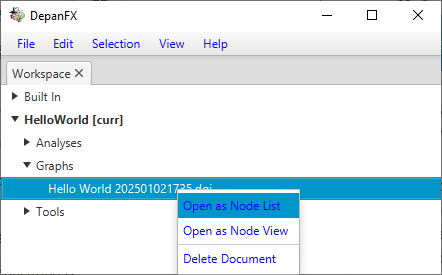
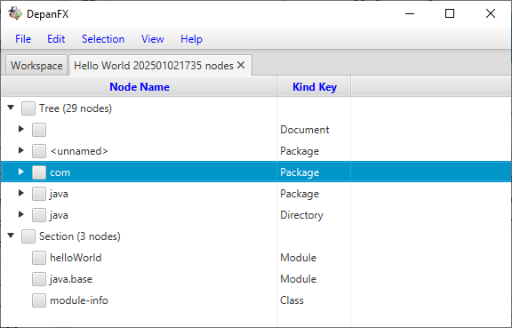
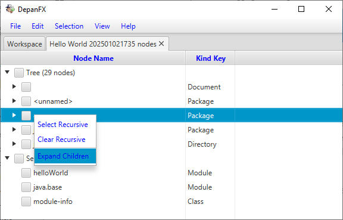
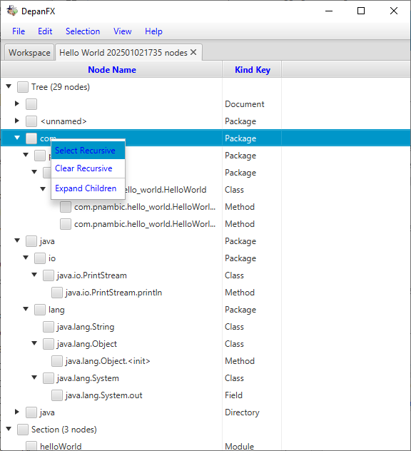
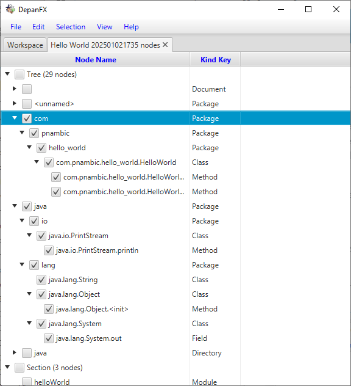
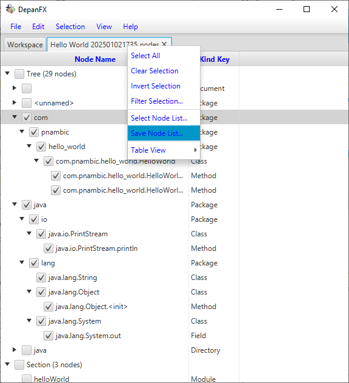
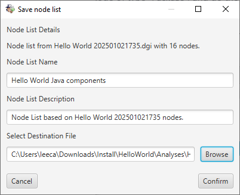
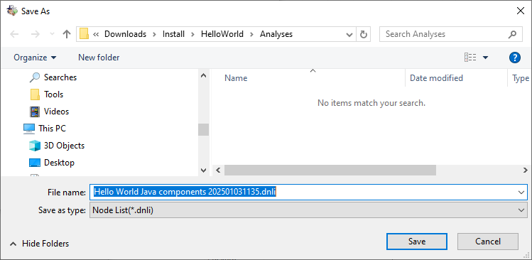
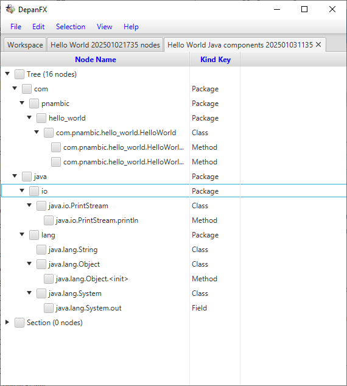

# Using Node List Panel

Returning to the workspace, our next goal is to visualize the nodes of the
HelloWorld application and select the Java components.  
 
The Node List panel displays the nodes of a dependency graph
in tabular form.
It provides powerful display mechanisms grouping and organizing the nodes
 of a large system.
The presentation of the nodes is very flexible,
with nodes grouped into user defined sections
and various details available in user defined columns.
The structure and nesting of nodes is defined by your selection of interesting relationships.

## Opening A Node List Panel

The node list panel provides a tabular view of nodes from a dependency graph.
The node list is often a subset of all the nodes in a dependency graph.
The analysis tools for dependency graphs (i.e. `.dgi` files) start
with a node list for all nodes in the graph.
Although DepanFX is comfortable with these large dependency graphs,
it can be daunting to start with everything.

For this introductory step, you will use the node list panel to select the
core Java components from the Hello, World applications.
Other components discovered during dependency graphs construction,
such as file system artifacts,
can be ignored for Java focused analyzes.

The Node List panel provides a compact and scalable presentation of selected nodes.
It is a presentation mechanism that is reused throughout DepanFX.
The ability to select and flexibly organize nodes is a key feature of DepanFX.

Although the HelloWorld example is not so overwhelming,
the node list panel is still a good place to start with DepanFX's features.

Right click on the `Hello World yyyyMMddhhmm.dgi` file to open the context menu,
and select the Open As Node List menu item.  
 
(You can also double click on the file to open it into a node list panel,
since that is the default action.)

## Expanding Node List Sections and Children

A new Node List Table tab will appear in the Editor region.
Selecting the new tab will show the node list table in the Editor region.
After opening the Tree and flat sections of the node list table,
the DepanFX node list table should resemble the following:  

Although the Node List Table structure is quite flexible,
the initial structure provides a tree section based on membership,
and a flat section that holds any left over nodes.
There are two columns, one that shows the name of each node and
one that shows the node kind for each node.

Opening the Tree section of the node list table shows 5 top level trees.
The HelloWorld node of type Document and the java node of type Directory
are inferred elements based on the dependency source.
These trees can be ignored.

The most interesting Java elements are in the two nodes of type Package.
The `com` node contains the elements of the Hello, World implementation.
The `java` node contains the Java elements that the implementation code relied upon.
You can expand these elements by using the Expand Children menu item from their context menu
(right mouse click).  

The three nodes under the flat section are components that do not have
any of relations included in the tree section.
By default, the Java tree section uses the built-in membership relations from
the File System container relationships
and Java package member relationships.
These do not include the relations from Java's module components.
For a simple rendering of Java components, these elements can be ignored.

## Selecting Interesting Nodes

The dependency graph construction processes strives for comprehensiveness,
and gathers as many nodes and relationships as feasible from its data sources.
This allows for the widest range for later analyzes,
but most analyzes are only interested in a subset of the nodes and the relations.
For this introduction, we are focusing on the Java components of the Hello, World application.

The previous step expanded the component trees for all of the Java components.
These can be selected individually by clicking the select box.
Entire trees of components can be selected with the `Select Recursive` menu item.

Right click on the `com` node, and select the `Select Recursive` menu item.  
 
This action adds the entire tree of software components to the current selection.

Right click on the `java` node of type `Package`,
and do the same - select the `Select Recursive` menu item.
These items will be the focus of our further analysis.  

## Saving Interesting Nodes

The current set of selected nodes can be saved as a node list.
This allows future analysis to use the same starting point consistently.
It captures the state of analysis,
and can be combined with other node list to offer insights on the structure of the system.

In order to save the table’s selected nodes as a new node list,
use the context menu from the Node List Table tab.  
 
The Save Node List option (towards the bottom),
brings up the Node List Save dialog box.  
 
This dialog box allows you to name the node list,
provide a description, and set the destination file for the node list.

By recommended best practices, node lists are placed into the Analyzes directory.  
 
This helps separate graphs from different analysis efforts.
Complex analyzes may benefit from additional substructure and directories
within the Analyzes directory.

After saving the node list, there will be a new document under the Analyzes directory.  

The file `Hello World Java components yyyyMMddhhmm.dnli` lists the nodes that are Java components.
The relationships between the nodes remain in the dependency graph and are accessible when needed.

If you select the new file in the Analyzes directory and select the Open As Node List menu item,
a new tab appears in the Editor tab panel.  
 

As before, selecting the tab will show a node list table in the Editor region.
This table will have only 16 nodes, consisting entirely of the Java components.

## Other Things To Explore

The node list panel provides selection, grouping, and presentation capabilities.
The node list panel is widely used in other components to present tabular
data for their interesting nodes.

There are multiple ways to manipulate the current section.
The panel's `Filter Selection...` menu item provides access to
the powerful capabilities of node filters.

The node list panel can present a variety of information about each node.
The panel's `Table View > Add Column >` menu allows for the addition of
columnar data.

