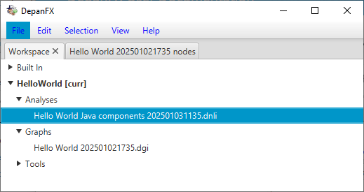
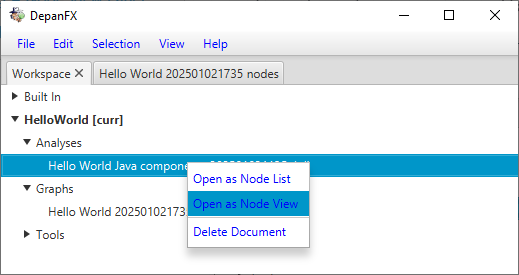
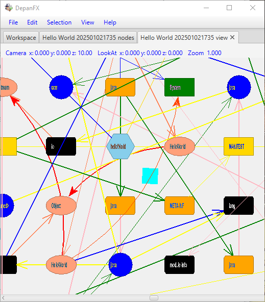
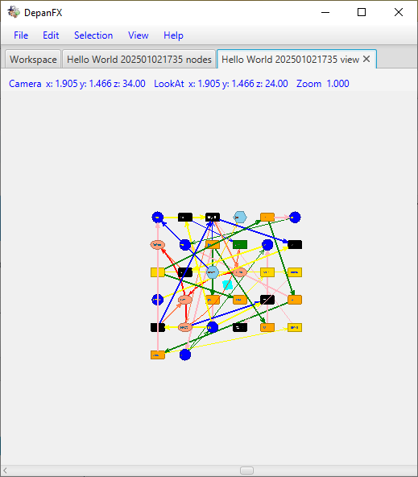
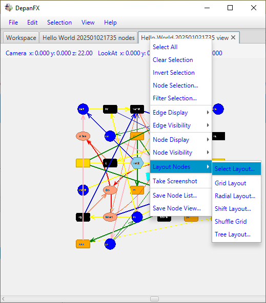
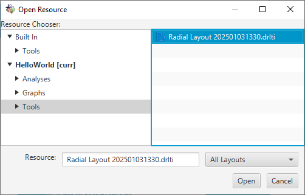
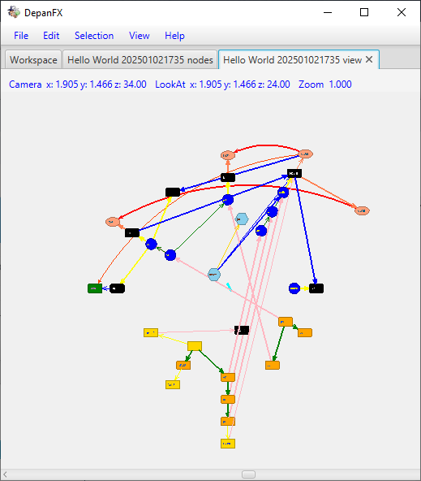
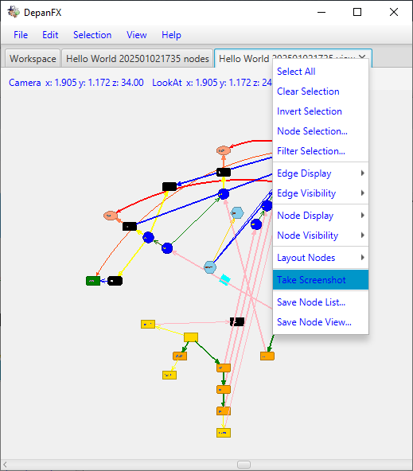
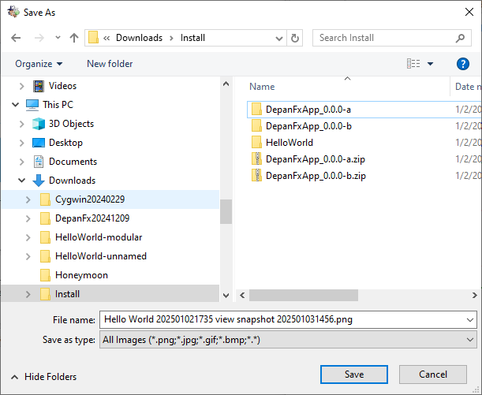

# Using the Node View Panel

Returning to the workspace, our next goal is to graphically display
the Java nodes and relationships.  

The presentation of the nodes is very flexible,
with nodes grouped into user defined sections
and various details available in user defined columns.
The structure and nesting of nodes is defined by your selection of interesting relationships.

## Opening A Node View Panel

The Node View editor provides powerful display mechanisms for a system’s nodes and relationships.
The display mechanisms use OpenGL to render high quality diagrams
of the nodes and their dependencies.
With various zoom and direction controls, it is possible to “fly”
through the code as you examine its structure.

In order to open the Node View editor, activate the Workspace tab.

Right click on the `Hello World yyyyMMddhhmm.dgi` file to open the context menu,
and select the Open As Node View menu item.  
 

The initial presentation is a bit cahotic.  

Even zoomed out, the initial presentation remains messy.
 
The initial set of 32 components are displayed in a grid layout,
with arrows going everywhere.

When a node list is opened as a node view, none of the nodes have been assigned a location.
The current default is a grid layout, whith each node placed on a retangular grid.
If there are more than a handful of nodes,
the initial node zoom will only show a few nodes.

## Selecting A Layout

Even zoomed out, the nodes do not present a useful structure.
We can expose their structure by using the layout options,
and adjusting the display and visibility of edges and nodes.

From the context menu on the Node View tab,
select the `Layout Nodes > Radial Layout` menu option.  

Use the resource chooser to select the Built In `Radial Layout` layout tool.  

After confirming your selection, the nodes in the view panel move to their new locations.  

The radial layout tool uses the same Java membership relationships a
the tree section of a node list panel, so it exposes a similar structure.

Due to the setup for edge visibility configuration,
membership relationships use straight arrows of various widths and colors,
and uses relationships are indicated by curved arrows.
These rendering choices can all be configured through the edge visibility side window.

Similarly, the shape, size and color to the nodes are based on a built in configuration
for Java dependency graphs.
These choices can all be configured through the node visibility side window.

## Grabbing A Screenshot

The ability to export data from DepanFX allows it to contribute to the larger engineering effort.
Diagrams are most useful if they can be shared with others.
Visual information has a compelling power to display unseen structure and
to communicate complex relationships.

From the context menu on the Node View tab,
select the `Take Screenshot` menu option.  

This brings up the save screenshot dialog using the local system's file chooser.  
 
The saved `.pdf` from the take screenshot command can be used as any image file.

Since a primary goal of screenshots is to share information outside of DepanFX,
screenshots should not be saved within a project.

## Save The View

PENDING

## Other Things To Explore

The Node View panel provides many tools to control
the selection, visibility, rendering, and placement of nodes and edges.
