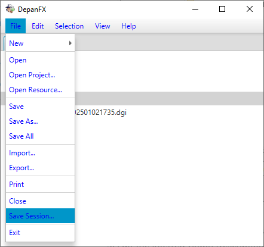
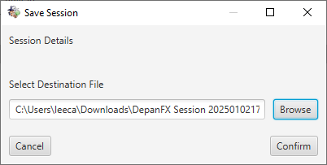

# Save The Session

The initial steps from the [Getting Started](GettingStarted.md) section have
added to the basic state for our session.
When DepanFx restarts, it would be best to restore the this enriched state.
The first step toward restoring the session is to save its current state.

First, let's close the Welcome panel.  We won't need Inspector Gonzo's cheery
greeting on the next DepanFX session.  Clicking the x in the tab's right edge
will close the Welcome panel.

## Save The Session

Now that the session is focused on our analysis workspace,
use the `Save Session...` menu choice under the File menu. 

The Save Session menu choice activates the Save Session dialog,
 which allows you to specify a location for the session state file.

The Browse button allows you to specific the location of the session state
file using the host system's file finder.  The file name for the session state
can be provided to DepanFX at startup time.  When this is done, the previously
available projects and analyzes are available when DepanFX starts.

Since sessions aggregate projects and other system analysis resources,
a session's state should never be stored within a project.
It's not uncommon for a session state file to be a sibling of its
included projects.

For large efforts, the domain pattern maybe appropriate.
A domain can be model with a directory that contains a set of projects
and a set of sessions.
The various sessions include their projects of focus,
and use analysis tools that are similarly fit to focus.

## Resume A Session

A saved session can be resumed by including the session state file as a
command parameter at application startup.

In the previous step, the session state was saved
to the `DepanFX Session 202401021756.xml` file.

When DepanFX is started with this file as the value of the `--session`
command line flag, the saved session state is restored.

    Install/DepanFxApp/bin/DepanFxApp --session="DepanFX Session 202501021756.xml"

