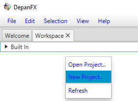

# Create A Project
Once DepanFX starts, the first action is the creation of a new project.
The new project will hold the analysis artifacts for a system under analysis.

1. Select the Workspace tab.
1. Right click in the Workspace panel to bring up the context menu.
1. Select “New Project…” 

1. In the System’s folder chooser, create a new folder (e.g. HelloWorld).
1. Select the new folder as the folder chooser’s result.

1. DepanFX populates the new folder standard analysis artifact folder
1. The new project folder is presented in the Workspace panel’s tree of projects.

Although any folder can be used as a project,
DepanFX will configure an empty folder with some internal structures that are
practical for software analysis projects.

These internal folders for a DepanFX project are

1. Graphs:  A folder to contain the full dependency graphs for systems under analysis.  Graphs include all of the nodes and their relationships.
1. Analyzes: A folder to contain analysis artifacts based on data from the various dependency graphs.  These include node list and visualization.
1. Tools: A folder to contain tool and option settings used during system analysis.  This folder is often further subdivided for different tool categories.

Creating or opening a project brings the project's directory structure
into the tree of items shown by the Workspace panel.
The project’s name is shown in bold, with the Analyzes, Graphs,
and Tools directories available for access.
