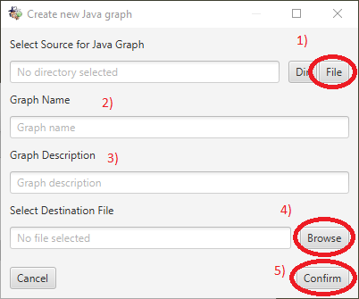
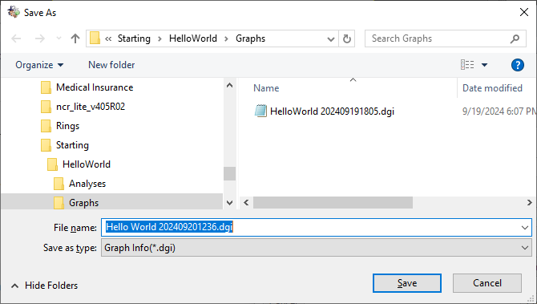
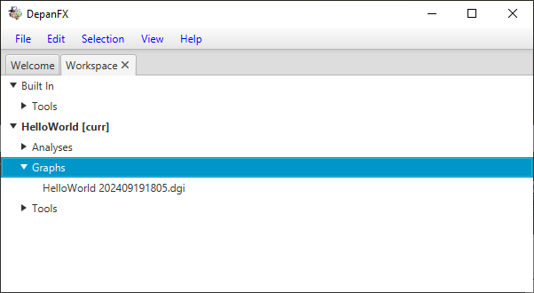

# Adding A Dependency Graph
Dependency graphs combine a collection of nodes with a collection of edges.
The elements define the basic structure of DepanFX’s approach to system analysis.
Dependency graphs are typically obtained from a snapshot of the system under analysis.
The dependency graph information is stored in a file ending `.dgi`
(an XML file that contains depan graph information).

The Graphs directory in a project provides a context menu that includes dependency graph creation.  A right-click on the Graphs folder brings up the context menu for this item.
The context menu for the Graphs folder includes several options to create a new dependency graph.
These options include:

* File System - create a File System dependency graph from a directory.
* Git Repo - create a File System dependency graph from a git repository.
* Java - create a Java dependency graph from a file or directory.

From the Graphs folder’s context menu, selecting the menu item `New Graph > Java`

brings up a dialog box to create a new dependency graph based on the Java Graph Model.

The highlighted numbers and buttons correspond with the
following sequence of actions for completing the dialog.
Once the dialog is complete,
Depan builds the dependency graph for the HelloWord
application and adds it to the Hello World Project.
The packaged jar file HelloWorld.jar provides a good start for exploring the
structure of Java applications.

1. Use the File button to open a File Chooser as the dependency source.
Navigate to the hello_world git clone, and select the HelloWorld.jar file.

1. Edit the inferred Graph Name if you want.
To follow the example, use “Hello World”.
1. Edit the inferred Graph Description if you want.
To follow the example, leave this unchanged.
1. Use the Browse button to open a File Chooser.
With the destination file empty,
Depan will infer a filename based on the Graph Name (step 2) with an autogenterated timestamp.
 
The interface will propose a file name in the Graphs container.
You can change the name, but the Graphs container is recommended.
To follow the example, use “Hello World” with the autogenerated timestamp.
1. Use the Confirm button to start the dependency graph construction.

For large systems, dependency graph construction may take several seconds.
There is currently no progress meter or other mechanism to interact with this
or other long running processes.

Once the dependency graph construction is complete,
there will be a new document under the Graphs directory.
 
The file `HelloWorld yyyyMMddhhmm.dgi` contains a snapshot of the
Java nodes and their relationships from within the `HelloWorld.jar` file.
