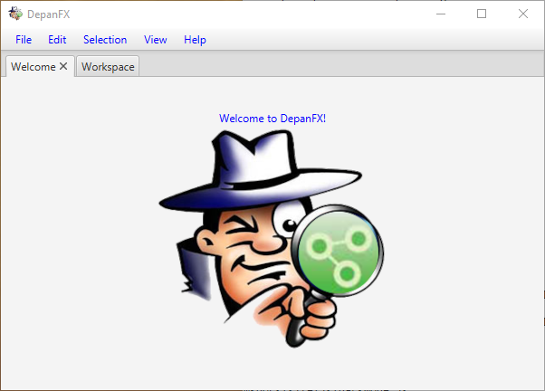

# Getting Started

When DepanFX initially starts, the session's initial scene is populated with
two panels: a Welcome panel, and a Workspace panel.  Each panel is accessible as
a tab in the initial scene's user interface.

The first tab, and the one displayed on startup, shows the Welcome panel.
The Welcome panel provides a cheery entrance to DepanFX.
Say “hi” to DepanFX’s mascot, Code Inspector (CI) Gonzo.
<br/>
The Welcome panel can be closed or ignored in most DepanFX sessions.

The second panel, labeled Workspace, is the main starting point for many DepanFX analyzes.
At the top level, a session’s workspace is a collection of projects.
Each project holds many different analysis resource,
typically grouped by system under analysis.
These include dependency graphs, lists of interesting nodes,
and assorted tools for extracting data from the graphs.

When DepanFX starts, the workspace is initialized with a “Built In” project.
This project provides a number of general purpose artifacts that can be used
in the analysis of many software systems.

## First Steps
Once DepanFX starts, it’s time to start analyzing a software system.  This requires:

1. Setting up an area to hold our analysis.
1. Obtaining the dependency graph for the system under analysis.
1. Opening the dependency graph, and searching for interesting structures.

These steps are discussed in each of the following sections.

For these steps, the examples are based on a simple implementation
of the classic “Hello, World!” application.
This implementation is available on GitHub at <https://github.com/pnambic/hello_world>.
The repository includes the source code, a build script,
and the packaged HelloWorld.jar.
If you clone the repository, you should be able to run the application with the Java interpreter.

```bash
$ java -jar HelloWorld.jar
Hello, World!
```


Although this is a simple system to analyze,
it is a good introduction to DepanFX’s capabilities.