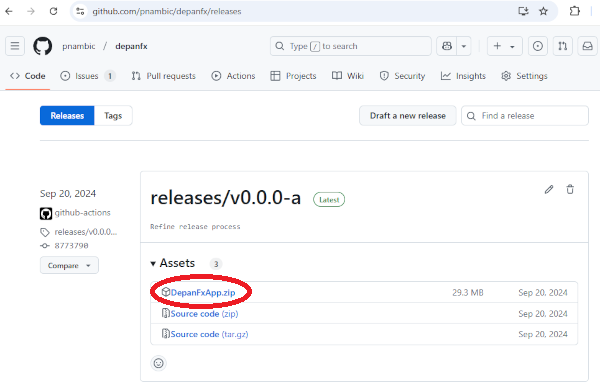
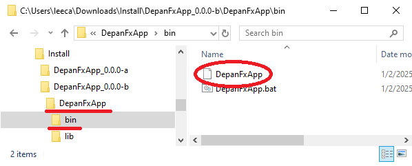

# Installation Guide

## System Requirements

DepanFX is built to run with Java 21.
In order to run DepanFX successfully, a valid Java 21 installation
should be available from the command line.

```bash
$ java -version
openjdk version "21.0.2" 2024-01-16 LTS
OpenJDK Runtime Environment Temurin-21.0.2+13 (build 21.0.2+13-LTS)
OpenJDK 64-Bit Server VM Temurin-21.0.2+13 (build 21.0.2+13-LTS, mixed mode, sharing)
```
What you enter: `java -version`.  What is essential: `21` (or better).

DepanFX can be a memory hog.  The analysis of large systems requires tracking many components.

Node views expect to use OpenGL for rendering.

## Installing from a distribution

DepanFX is distributed as a GitHub release artifact.
The DepanFX distribution is provided as a zip file that you can download and unzip for use.

The lastest DepanFX releases are listed on the main
[depanfx](https://github.com/pnambic/depanfx/) GitHub page.
The full list of available releases are accessible on the
[GitHub Releases](https://github.com/pnambic/depanfx/releases) page.

1. Download the zip distribution file from the depanfx GitHub page.
   
1. Unzip the distribution file into an installation folder.
   The Application directory can be a good choice.
   The distribution file unpacks into a couple of top-level directories
   (`./bin`, `./lib`) under the name of the zip file.
1. Start DepanFX by starting the DepanFX command file.
   This is the `DepanFxApp` command file under the `bin` directory.
   
   <br/>For windows, double click on the `DepanFxApp.bat` file.
   For Unix, Linux, cygwin, and related platforms, run the `./DepanFxApp` command file.

Assuming a compatible Java can be located, DepanFX should open the first time
with a Welcome window and the Workspace tab showing in the main editor frame.


You should be greeted with the welcoming gaze of Code Inspector (CI) Gonzo,
the mascot for DepanFX.

## Installation from GitHub
Installation from GitHub requires building the application from source.
This should be straightforward if a Java 21 or higher SDK is available.

The OpenJDK for Java 21 (and others) is available at <https://jdk.java.net/java-se-ri/21>.

In addition to the SDK’s basic build tools, DepanFX is built with Gradle 8.6.
Gradle 8.6 is available at
<https://gradle.org/next-steps/?version=8.6&format=bin>.

With these tools in place, installation from GitHub should involve these steps.

1. Clone the source code from the repository.
1. Change directory into the clone.
1. Use gradle to build and run depanfx.

```bash
$ git clone https://github.com/pnambic/depanfx.git
$ cd depanfx
$ ./gradlew run
```

Assuming compatible tooling can be located, DepanFX should open the first time
with a Welcome window and the Workspace tab showing in the main editor frame.


You should be greeted with the welcoming gaze of Code Inspector (CI) Gonzo,
the mascot for DepanFX.
